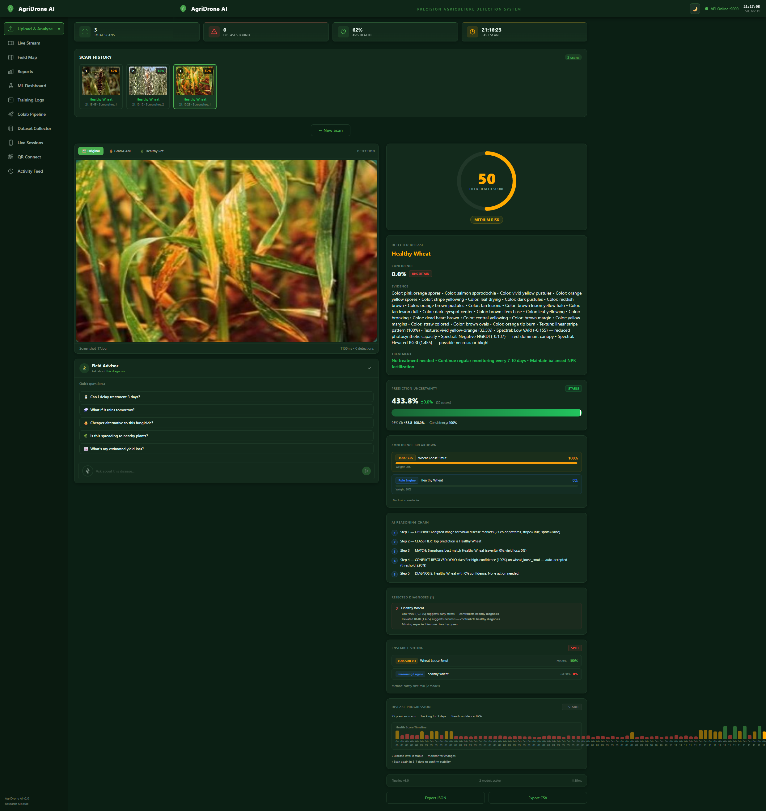
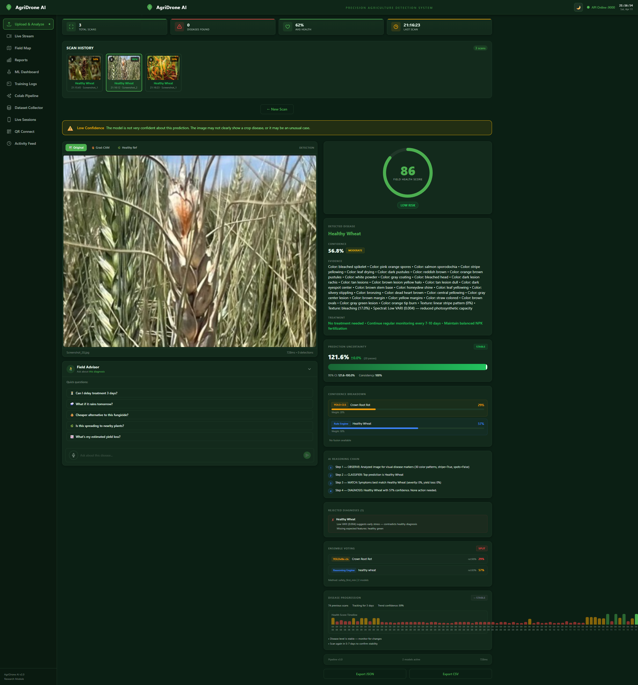
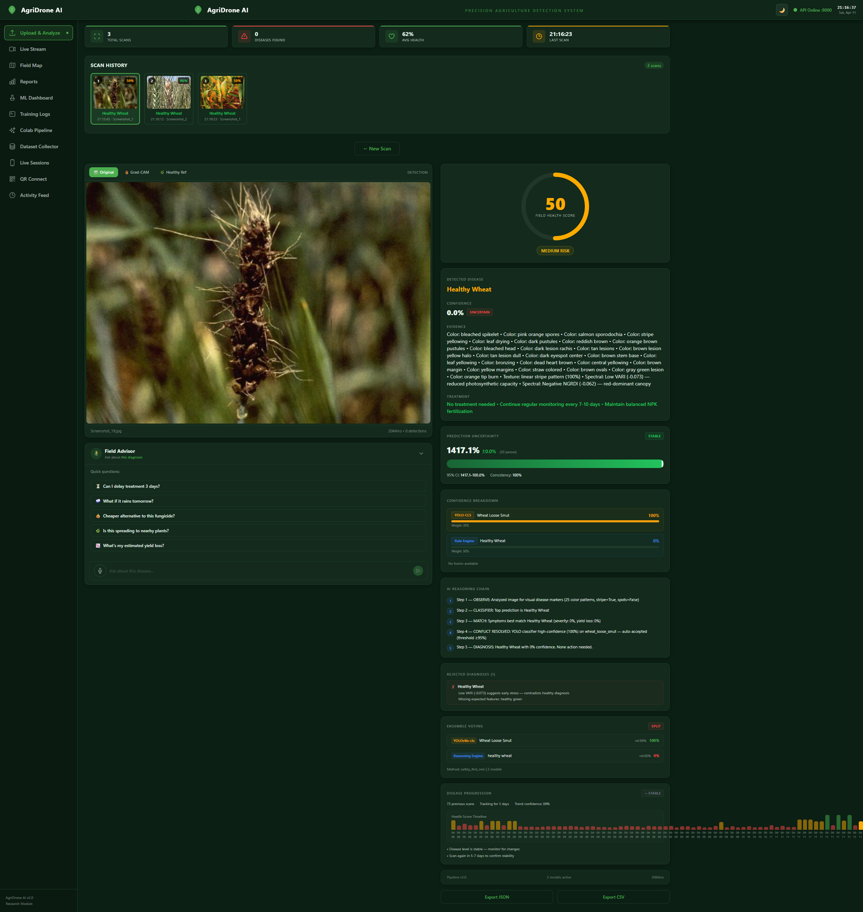

<div align="center">

# 🌾 AgriDrone

### A Systematic Ablation Study of Hybrid Deep-Learning Pipelines for Drone-Based Crop Disease Detection in Indian Wheat and Rice

[](https://www.python.org/downloads/)
[](https://fastapi.tiangolo.com/)
[](https://github.com/ultralytics/ultralytics)
[](LICENSE)
[](CHANGELOG_RESEARCH_UPGRADE.md)
[](RESEARCH_PAPER_FINAL_v3.md)

</div>

---

> **Project Status: Research Prototype.** This is a research codebase, not a
> production system. All reported numbers are validated on curated close-up
> leaf photographs; they are **not** a claim of field-ready drone deployment.
> See [Known Limitations](#known-limitations) and
> [Research Roadmap](#research-roadmap) below.

AgriDrone is a research codebase that combines a YOLOv8n-cls classifier (1.44M parameters), a six-rule symptom reasoning engine, Bayesian ensemble voting, Grad-CAM explainability, and an expected monetary loss (EML) estimator for **21 Indian wheat and rice disease classes**. Through a three-configuration ablation study on 935 curated close-up leaf images, we show that the standalone YOLO classifier (96.15% accuracy, 15 ms) is statistically indistinguishable from the full hybrid pipeline (95.72%, 444 ms) — the rule engine adds 29× latency with zero accuracy gain. The v4 paper extends this to a multi-architecture matrix and re-audits the baseline under a shared training recipe; the core message is: **ablate before you complicate.**

## Key Results

| Configuration | Accuracy | Macro-F1 | MCC | Latency |
|:---|:---:|:---:|:---:|:---:|
| **Config A** — YOLO-only | **96.15%** | **0.962** | **0.960** | **15 ms** |
| **Config B** — YOLO + Rules | 95.72% | 0.957 | 0.955 | 444 ms |
| **Config C** — Rules-only | 13.41% | 0.077 | 0.096 | 392 ms |

- McNemar's test: χ² = 2.25, *p* = 0.134 (A vs B — **not significant**)
- Cross-dataset (PDT, 672 images): 84.4% accuracy, F1 = 0.915, 100% disease recall
- Sensitivity analysis: 125 weight configs, macro-F1 σ = 0.0087
- EML: ₹294.33 (Config A) vs ₹2,769.06 (Config B) — 9.4× cost gap

## System Architecture

```
┌─────────────────────────────────────────────────────────┐
│                    Layer 1: INPUT                        │
│  Drone camera (RGB) → JPEG upload → FastAPI /detect      │
└────────────────────────┬────────────────────────────────┘
                         ▼
┌─────────────────────────────────────────────────────────┐
│                Layer 2: PERCEPTION                       │
│  YOLOv8n-cls → top-5 class probabilities                 │
│  1.44M params │ 3.4 GFLOPs │ 224×224 input               │
│  21 classes: 14 wheat + 5 rice + 2 healthy               │
└────────────────────────┬────────────────────────────────┘
                         ▼
┌─────────────────────────────────────────────────────────┐
│                Layer 3: REASONING                        │
│  Feature Extractor → 20+ visual metrics                  │
│  Rule Engine → 6 scoring rules + conflict resolution     │
│  Spectral Indices → VARI, RGRI, GLI                      │
│  Ensemble Voter → Bayesian fusion (0.70/0.30)            │
└────────────────────────┬────────────────────────────────┘
                         ▼
┌─────────────────────────────────────────────────────────┐
│                Layer 4: DECISION                         │
│  Confidence-based YOLO auto-win (≥0.95)                  │
│  Grad-CAM attention visualisation                        │
└────────────────────────┬────────────────────────────────┘
                         ▼
┌─────────────────────────────────────────────────────────┐
│              Layer 5: PRESCRIPTION                       │
│  Treatment lookup │ Yield-loss estimation │ EML           │
└────────────────────────┬────────────────────────────────┘
                         ▼
┌─────────────────────────────────────────────────────────┐
│              Layer 6: PRESENTATION                       │
│  React dashboard │ Grad-CAM heatmap │ Reasoning chain    │
│  Differential diagnosis │ JSON/CSV export                │
└─────────────────────────────────────────────────────────┘
```

## Disease Classes (21)

| Category | Classes |
|:---|:---|
| **Wheat diseases (14)** | aphid, black rust, blast, brown rust, Fusarium head blight, leaf blight, mite, powdery mildew, root rot, septoria, smut, stem fly, tan spot, yellow rust |
| **Rice diseases (5)** | bacterial blight, blast, brown spot, leaf scald, sheath blight |
| **Healthy (2)** | healthy wheat, healthy rice |

## Repository Structure

```
agri-drone/
├── src/agridrone/              # Core Python package
│   ├── api/                    #   FastAPI routes & schemas
│   ├── vision/                 #   YOLO inference, rule engine, Grad-CAM, ensemble
│   ├── core/                   #   Detector, spectral features, yield estimator
│   ├── knowledge/              #   Disease knowledge base (JSON)
│   ├── prescription/           #   Treatment recommendation rules
│   ├── geo/                    #   Geospatial referencing & grid mapping
│   ├── io/                     #   Image/sensor/telemetry loaders, exporters
│   ├── environment/            #   Environmental feature fusion
│   ├── feedback/               #   Correction aggregation & KB updates
│   ├── services/               #   LLM service, report generation
│   ├── types/                  #   Pydantic data models
│   ├── config.py               #   Application settings
│   └── logging.py              #   Loguru logging config
├── evaluate/                   # Evaluation & ablation scripts
│   ├── ablation_study.py       #   Three-config ablation (A/B/C)
│   ├── statistical_tests.py    #   Bootstrap CIs, McNemar's test
│   ├── pdt_cross_eval.py       #   Cross-dataset PDT evaluation
│   ├── sensitivity_analysis.py #   125-config weight sweep
│   ├── eml_analysis.py         #   Expected monetary loss
│   ├── test_4_images.py        #   Pipeline verification
│   └── results/                #   JSON, CSV, PNG outputs
├── scripts/                    # Utility scripts
│   ├── run_inference.py        #   Single/batch inference
│   ├── train_model.py          #   YOLOv8 training
│   └── dashboard.py            #   Web UI launcher
├── configs/                    # YAML configuration files
├── tests/                      # pytest unit & integration tests
├── dashboard/                  # React + Vite + TailwindCSS frontend
├── models/                     # Model weights (see Data Availability)
├── data/                       # Dataset splits (see Data Availability)
├── notebooks/                  # Jupyter notebooks
├── docs/                       # Additional documentation
├── RESEARCH_PAPER_FINAL_v3.md  # Submission-ready research paper
├── pyproject.toml              # Package configuration
├── requirements.txt            # Python dependencies
└── .env.example                # Environment variable template
```

## Screenshots

### AgriDrone Dashboard — Live Disease Detection

<p align="center">
  
</p>
<p align="center">
  
</p>
<p align="center">
  
</p>

> Real-time wheat and rice disease detection with Grad-CAM explainability, field health score, confidence breakdown, AI reasoning chain, and treatment recommendations.

## Installation

### Prerequisites

- Python 3.11+
- NVIDIA GPU with CUDA support (recommended)
- Node.js 18+ (for frontend dashboard)

### Backend Setup

```bash
# Clone the repository
git clone https://github.com/<your-username>/agri-drone.git
cd agri-drone

# Create virtual environment
python -m venv .venv
.venv\Scripts\activate        # Windows
# source .venv/bin/activate   # Linux/macOS

# Install dependencies
pip install -r requirements.txt

# Copy environment config
copy .env.example .env        # Windows
# cp .env.example .env        # Linux/macOS
```

### Download Model Weights

Model weights are hosted separately due to file size. Download from the links in [Data Availability](#data-availability) and place them in `models/`:

```
models/
├── india_agri_cls_21class_backup.pt   # 21-class classifier (2.88 MB)
├── india_agri_cls.pt                  # 4-class wheat classifier (2.83 MB)
├── efficientnet_b0_21class.pt         # EfficientNet backbone (15.68 MB)
└── yolo_crop_disease.pt               # Detection model (21.48 MB)
```

### Frontend Setup (Optional)

```bash
cd dashboard
npm install
npm run dev
```

## Usage

### Start the API Server

```bash
# From project root
uvicorn src.agridrone.api.app:app --host 0.0.0.0 --port 8000 --reload
```

### Single Image Inference

```bash
python scripts/run_inference.py --image path/to/image.jpg --model models/india_agri_cls_21class_backup.pt
```

### Launch Dashboard

```bash
python scripts/dashboard.py
```

The React dashboard will be available at `http://localhost:5173` with the API at `http://localhost:8000`.

## Reproducing the Ablation Study

All evaluation scripts are in `evaluate/`. Results are written to `evaluate/results/`.

```bash
# 1. Three-configuration ablation (Config A, B, C)
python evaluate/ablation_study.py \
    --model-path models/india_agri_cls_21class_backup.pt

# 2. Statistical tests (Bootstrap CIs + McNemar's)
python evaluate/statistical_tests.py \
    --results-dir evaluate/results --n-boot 10000

# 3. Cross-dataset evaluation on PDT
python evaluate/pdt_cross_eval.py \
    --dataset-dir datasets/externals/PDT_datasets/"PDT dataset"/"PDT dataset" \
    --model-path models/india_agri_cls.pt

# 4. Sensitivity analysis (125 weight configurations)
python evaluate/sensitivity_analysis.py

# 5. Expected monetary loss analysis
python evaluate/eml_analysis.py

# 6. Pipeline verification (4-image test)
python evaluate/test_4_images.py
```

### Expected Outputs

| Script | Key Output Files |
|:---|:---|
| `ablation_study.py` | `ablation_summary.json`, `ablation_table.csv`, confusion matrices (PNG) |
| `statistical_tests.py` | `statistical_tests.json`, `mcnemar.json` |
| `pdt_cross_eval.py` | `cross_dataset_PDT.json`, `cross_dataset_PDT_predictions.csv` |
| `sensitivity_analysis.py` | `sensitivity_summary.json`, `sensitivity_grid.csv` |
| `eml_analysis.py` | `eml_summary.json`, `eml_comparison.csv`, `eml_bar_chart.png` |

## Dataset

### Primary Dataset (21 classes)

| Split | Images | Per class (approx.) |
|:---|:---:|:---:|
| Train | 4,364 | ~208 |
| Validation | 935 | ~45 |
| Test | 935 | ~45 |

Stratified 70/15/15 split with seed = 42.

### External Dataset: Plant Disease Treatment (PDT)

- 672 images (105 healthy LH + 567 unhealthy LL)
- Binary healthy/unhealthy classification
- Significant domain shift (close-up training → whole-field aerial)

## Data Availability

| Resource | Location | DOI |
|:---|:---|:---|
| Source code | This repository | — |
| Model weights | [Google Drive / Zenodo] | [DOI pending] |
| Primary dataset | [Google Drive / Zenodo] | [DOI pending] |
| PDT dataset | [Publicly available](https://github.com/) | See original source |
| Evaluation results | `evaluate/results/` in this repo | — |

> **Note:** Update the links above after uploading to Google Drive and/or Zenodo.

## Citation

If you use AgriDrone in your research, please cite:

```bibtex
@article{agridrone2025,
  title     = {AgriDrone: A Systematic Ablation Study of Hybrid Deep-Learning
               Pipelines for Drone-Based Crop Disease Detection in Indian
               Wheat and Rice},
  author    = {[Author names]},
  journal   = {Smart Agricultural Technology},
  publisher = {Elsevier},
  year      = {2025},
  note      = {Under review}
}
```

## License

This project is licensed under the MIT License — see the [LICENSE](LICENSE) file for details.

## Acknowledgements

- [Ultralytics YOLOv8](https://github.com/ultralytics/ultralytics) for the classification backbone
- [Grad-CAM](https://github.com/jacobgil/pytorch-grad-cam) for explainability visualisations
- The Plant Disease Treatment (PDT) dataset authors for external validation data

---

<div align="center">

**[Paper](RESEARCH_PAPER_FINAL_v3.md) · [Installation](#installation) · [Reproduce Results](#reproducing-the-ablation-study) · [Citation](#citation)**

</div>


## Known Limitations

- **Domain mismatch.** All training and test images are curated close-up leaf
  photographs (PlantVillage, UCI Rice Leaf, Kaggle rice pest). They are **not**
  drone-altitude aerial imagery of farm canopies. The "drone-based" label in
  the v3 paper title described the intended deployment, not the evaluation
  distribution; the v4 paper corrects this framing. See
  `docs/data_availability.md`.
- **Cross-dataset PDT result is degenerate at argmax.** The headline v3
  numbers on the PDT dataset (84.4% accuracy, 100% recall) correspond to the
  model collapsing to the constant prediction `unhealthy`. At the argmax
  operating point specificity is 0%. Section §5.4 of the v4 paper and
  `evaluate/pdt_v2.py` report ROC/PR sweeps, few-shot fine-tuning and
  calibration as remediation; those numbers are tagged
  `[TO BE RE-RUN]` until executed on a GPU host.
- **Baseline recall.** The 76.15% EfficientNet-B0 number reported in v3 was
  trained with ad-hoc settings that were not matched to the YOLO recipe. A
  fair re-audit under the shared recipe is implemented in
  `evaluate/matrix/audit_baseline.py` and will replace the v3 baseline in
  v4.
- **Economics.** The legacy EML table was hand-tabulated. The v4 costs file
  (`configs/economics/india_2025.yaml`) carries per-entry
  citations; uncited entries are excluded from the headline number and
  appear only in the sensitivity scenario.
- **Statistical protocol.** v3 reported a single McNemar test. v4 adds
  per-class bootstrap CIs, Holm-Bonferroni correction across 21 per-class
  tests, Dietterich 5×2cv for variance, and Friedman-Nemenyi for ranking
  backbones in the matrix; see `evaluate/statistical_tests_v2.py`.

## Research Roadmap

The `research-upgrade` branch adds:

1. A regression safety net (`tests/regression`, `scripts/smoke_test.py`,
   `.github/workflows/ci.yml`).
2. A reframed paper draft (`RESEARCH_PAPER_v4.md`) that presents the
   rule-engine result as a negative result and documents data provenance.
3. A 6×4×5×4×5 experiment matrix
   (`configs/matrix/full.yaml`, `evaluate/matrix/run_matrix.py`).
4. A fair EfficientNet-B0 re-audit under a shared training recipe.
5. The expanded statistical protocol above.
6. A PDT rescue pipeline (threshold sweep, few-shot, calibration).
7. Learned and LLM-generated rule baselines
   (`rule_engine_base.py`, `rules_learned.py`, `rules_llm.py`) that
   share a common `RuleEngine` protocol with the existing handcrafted
   engine, which remains the default.
8. Cited, sensitivity-aware economics
   (`configs/economics/india_2025.yaml`, `evaluate/eml_sensitivity.py`).
9. Reproducibility bundle (`scripts/download_data.py`,
   `scripts/make_splits.py`, `CITATION.cff`, `requirements.lock.txt`,
   `Dockerfile`, `docker-compose.yml`, `docs/data_availability.md`).
10. Repo hygiene: this README, `CHANGELOG_RESEARCH_UPGRADE.md`, and a PR
    description.

Artifacts under `evaluate/results/v2/` tagged `[TO BE RE-RUN]` require a
GPU host to materialise the real numbers. The scaffolding, schemas, and CLI
all run end-to-end on CPU today, which is what makes the upgrade safe: every
existing v3 result file is preserved byte-identical.
